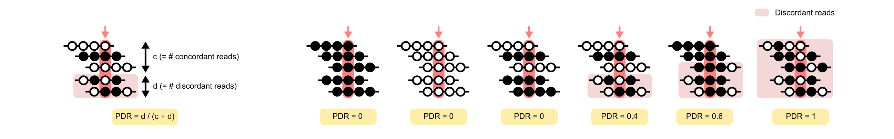
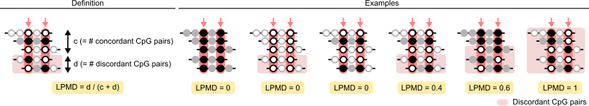
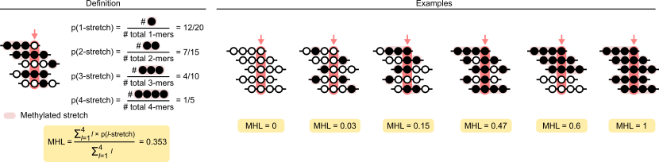
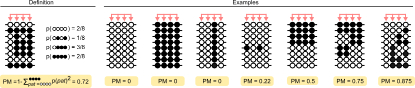

# Metheor ☄

[](https://anaconda.org/dohlee/metheor)


Compute DNA methylation heterogeneity levels from Bismark-aligned bisulfite sequencing data.

## Installation
Install with `conda`.
```
conda install -c dohlee metheor
```

## Usage

### Supported methylation heterogeneity measures

`Metheor` supports seven methylation heterogeneity measures in total.

**Proportion of discordant reads (PDR)**



PDR is defined as a fraction of reads carrying CpGs in discordant methylation states (i.e. containing both methylated and unmethylated CpGs in a single read) with respect to all reads mapped to a CpG.
```
metheor pdr --input <input.bam> --output <output.tsv>
    --min-depth <min_depth> --min-cpgs <min_cpgs>
    --min-qual <min_qual> --cpg-set <cpg_set.bed>
```

*Options*

- `-i, --input`: Path to input BAM file.
- `-o, --output`: Path to output table file summarizing the result of PDR calculation.
- `-d, --min-depth`: Minimum depth of CpG stretches to consider. [default: 10]
- `-p, --min-cpgs`: Minimum number of consecutive CpGs in a CpG stretch to consider. [default: 10]
- `-q, --min-qual`: Minimum quality for a read to be considered [default: 10]
- `-c, --cpg-set`: (Optional) Specify a predefined set of CpGs (in BED file) to be analyzed.

**Local pairwise methylation disorder (LPMD)**



We introduce LPMD as a new measure to quantify the local concordance of DNA methylation states.
The conceptual basis of LPMD is similar to PDR as they both are aware of local homogeneity of DNA methylation states, but they are different in that LPMD explicitly takes the distance between CpGs into consideration.
In detail, LPMD is defined as a fraction of CpG pairs within a given range of genomic distance (i.e., CpG pairs more distant than m basepairs and closer than M basepairs) and therefore, LPMD is defined for a *pair* of CpGs, but not for a single CpG.
Importantly, we note that while there is an increased tendency of observing discordant reads solely by change, according to the definition in PDR, as the sequencing read gets longer, LPMD is not dependent on the length of sequencing reads.

```
metheor lpmd --input <INPUT> --output <OUTPUT>
    --pairs --min-distance <min_distance> --max-distance <max_distance>
    --min-qual <min_qual> --cpg-set <cpg_set.bed>
```

*Options*

- `-i, --input`: Path to input BAM file.
- `-o, --output`: Path to output table file summarizing the result of LPMD calculation.
- `-p, --pairs`: (Optional) Concordance information for all CpG pairs.
- `-m, --min-distance`: Minimum distance between CpG pairs to consider. [default: 2]
- `-M, --max-distance`: Maximum distance between CpG pairs to consider. [default: 16]
- `-q, --min-qual`: Minimum quality for a read to be considered. [default: 10]
- `-c, --cpg-set`: (Optional) Specify a predefined set of CpGs (in BED file) to be analyzed.

**Methylation haplotype load (MHL)**



The concept of MHL is also based on the local homogeneity of DNA methylation states, or co-methylation, due to the processivity of enzymes responsible for (de-)methylation of cytosines (Guo et al., 2017).
While PDR and LPMD focus on how much the tendency of co-methylation is perturbed in the given population of cells, MHL focuses on how well the methylation haplotypes (i.e., *stretch* of consecutive methylated CpGs) are conserved throughout the cell population for a given genomic region.
MHL is first devised to systematically identify the genomic blocks harboring CpGs with tightly coupled methylation states.
In detail, MHL is computed as a fraction of observed *fully methylated stretches* out of the all stretches of every possible lengths.

```
metheor mhl --input <input.bam> --output <output.tsv>
    --min-depth <min-depth> --min-cpgs <min-cpgs> --min-qual <min-qual>
    --cpg-set <cpg-set.bed>
```

*Options*
- `-i, --input`: Path to input BAM file.
- `-o, --output`: Path to output table file summarizing the result of epipolymorphism calculation.
- `-d, --min-depth`: Minimum depth of reads covering epialleles to consider. [default: 10]
- `-p, --min-cpgs`: Minimum number of consecutive CpGs in a CpG stretch to consider.
- `-q, --min-qual`: Minimum quality for a read to be considered. [default: 10]
- `-c, --cpg-set`: (Optional) Specify a predefined set of CpGs (in BED file) to be analyzed.


**Epipolymorphism (PM)**



Landan et al., proposed another measure named epipolymorphism (PM), which also captures the amount of heterogeneity of DNA methylation for a given genomic region. The relationship between ME and PM is analogous to that between entropy and Gini index used for decision trees, and they can be considered as similar measures of DNA methylation heterogeneity in general. Using `metheor`, PM can be calculated with the command below:
```
metheor pm --input <input.bam> --output <output.tsv>
    --min-depth <min-depth> --min-qual <min-qual> --cpg-set <cpg-set.bed>
```

*Options*

- `-i, --input`: Path to input BAM file.
- `-o, --output`: Path to output table file summarizing the result of epipolymorphism calculation.
- `-d, --min-depth`: Minimum depth of reads covering epialleles to consider. [default: 10]
- `-q, --min-qual`: Minimum quality for a read to be considered. [default: 10]
- `-c, --cpg-set`: (Optional) Specify a predefined set of CpGs (in BED file) to be analyzed.

**Methylation entropy (ME)**


Xie et al. proposed an information theoretic measure called methylation entropy (ME), which is calculated as the entropy of epialleles originating from a single genomic locus. 
```
metheor me --input <INPUT> --output <OUTPUT>
    --min-depth <min-depth> --min-qual <min-qual> --cpg-set <cpg-set.bed>
```

*Options*

- `-i, --input`: Path to input BAM file.
- `-o, --output`: Path to output table file summarizing the result of ME calculation.
- `-d, --min-depth`: Minimum depth of reads covering epialleles to consider. [default: 10]
- `-q, --min-qual`: Minimum quality for a read to be considered. [default: 10]
- `-c, --cpg-set`: (Optional) Specify a predefined set of CpGs (in BED file) to be analyzed.

**Fraction of discordant read pairs (FDRP)**

FDRP and qFDRP are measures of epigenetic diversity within a cell population that were first proposed in Scherer et al. (2020).
While PM and ME quantify the epiallelic diversity in terms of CpG quartets, FDRP and qFDRP allow the computation of epiallelic diversity in a single CpG resolution.
The key principle underlying the FDRP and qFDRP is as follows.
When epialleles are perfectly homogeneous for a short genomic region, any two sequencing reads aligned to that region will have identical methylation states for CpGs that are common to the two reads.
On the other hand, as epialleles become more diverse, it is more likely to observe a read pair that have different methylation states for common CpGs.
Based on this notion, FDRP and qFDRP computes a CpG-wise epigenetic diversity by examining pairs of sequencing reads covering the CpG.
Since the time required for all pairwise examination of sequencing reads increases exponentially along with the sequencing depth, the authors adopt a read sampling strategy to make those measures computed in a feasible time.
Therefore, the maximum numbers of reads to consider `M` is a crucial parameter modulating the balance between the precision of the measures and the computing time.

FDRP is defined as a fraction of (sampled) read pairs that are discordant (i.e., at least one CpG common to the two rads have different methylation state).

```
metheor fdrp --input <input.bam> --output <output.tsv>
    --min-qual <min-qual> --max-depth <max-depth> --min-overlap <min-overlap>
    --cpg-set <cpg-set.bed>
```

*Options*

- `-i, --input`: Path to input BAM file.
- `-o, --output`: Path to output table file summarizing the result of epipolymorphism calculation.
- `-q, --min-qual`: Minimum quality for a read to be considered. [default: 10]
- `-d, --min-depth`: Minimum depth of reads covering epialleles to consider. [default: 10]
- `-D, --max-depth`: Maximum number of reads to consider. [default: 40]
- `-l, --min-overlap`: Minimum overlap between two reads to consider in basepairs. [default: 35]
- `-c, --cpg-set`: (Optional) Specify a predefined set of CpGs (in BED file) to be analyzed.

**Quantative fraction of discordant read pairs (qFDRP)**

```
metheor qfdrp --input <input.bam> --output <output.tsv>
    --min-qual <min-qual> --max-depth <max-depth> --min-overlap <min-overlap>
    --cpg-set <cpg-set.bed>
```

qFDRP is a soft-version of FDRP.
Instead of deciding whether the read pair is discordant, qFDRP computes the normalized hamming distance.
Note that when the methylation states of the common CpGs are completely same, normalized hamming distance will be 0, and when the methylation states are completely different, it will be 1, which makes qFDRP calculation equivalent to FDRP.

*Options*

- `-i, --input`: Path to input BAM file.
- `-o, --output`: Path to output table file summarizing the result of epipolymorphism calculation.
- `-q, --min-qual`: Minimum quality for a read to be considered. [default: 10]
- `-d, --min-depth`: Minimum depth of reads covering epialleles to consider. [default: 10]
- `-D, --max-depth`: Maximum number of reads to consider. [default: 40]
- `-l, --min-overlap`: Minimum overlap between two reads to consider in basepairs. [default: 35]
- `-c, --cpg-set`: (Optional) Specify a predefined set of CpGs (in BED file) to be analyzed.

### Miscellaneous

**Add bismark `XM` tag to BAM file created with aligners other than bismark**
```
metheor tag --input <INPUT.bam> --output <OUTPUT.bam> --genome <GENOME.fa>
```

*Options*

- `-i, --input`: Path to input BAM file.
- `-o, --output`: Path to output BAM file tagged with XM tag.
- `-g, --genome`: Path to genome fasta file.